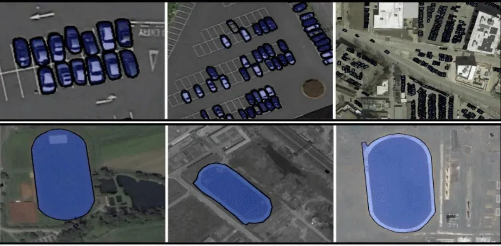
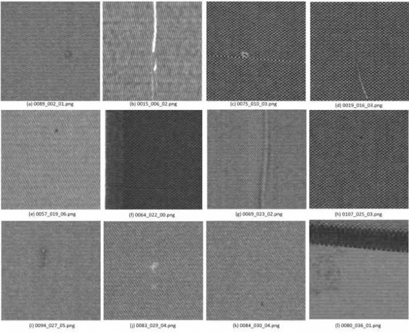
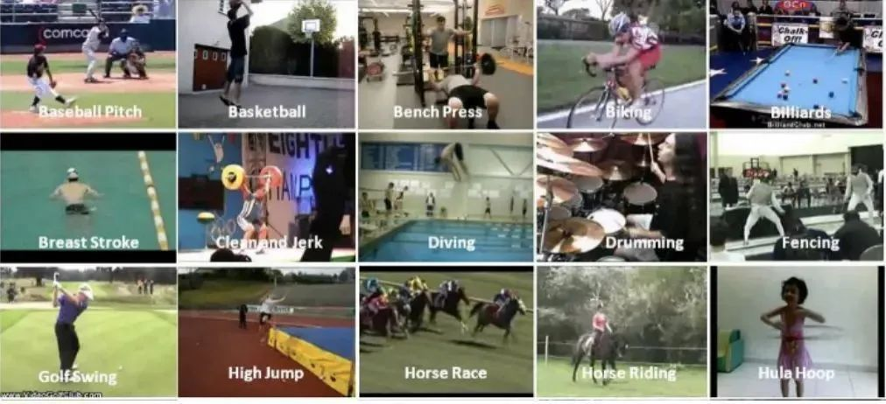

# Object-Detection-Datasets
90+ open-source datasets for deep learning
# 目录
# 一、导读
本文整理汇总了90+深度学习各方向的开源数据集，包含了小目标检测、目标检测、工业缺陷检测、人脸识别、姿态估计、图像分割、图像识别等方向。附下载链接。
# 二、小目标检测
## 2.1 AI-TOD航空图像数据集
数据集下载地址：http://m6z.cn/5MjlYk

AI-TOD 在 28,036 张航拍图像中包含 8 个类别的 700,621 个对象实例。与现有航拍图像中的目标检测数据集相比，AI-TOD 中目标的平均大小约为 12.8 像素，远小于其他数据集。

## 2.2 iSAID航空图像大规模数据集
数据集下载地址：http://m6z.cn/6nUrYe

现有的 Earth Vision 数据集要么适用于语义分割，要么适用于对象检测。iSAID 是第一个用于航空图像实例分割的基准数据集。这个大规模和密集注释的数据集包含 2,806 张高分辨率图像的 15 个类别的 655,451 个对象实例。iSAID 的显着特征如下：

(a) 大量具有高空间分辨率的图像；

(b) 十五个重要且常见的类别；

(c) 每个类别的大量实例；

(d) 每个类别的大量标记实例图像，这可能有助于学习上下文信息；

(e) 巨大的对象尺度变化，通常在同一图像内包含小、中和大对象；

(f) 图像内具有不同方向的对象的不平衡和不均匀分布，描绘真实-生活空中条件；

(g) 几个小尺寸物体，外观模糊，只能通过上下文推理来解决；

(h) 由专业注释者执行的精确实例级注释，由符合良好规范的专家注释者交叉检查和验证定义的指导方针。

## 2.3 TinyPerson数据集
数据集下载地址：http://m6z.cn/6vqF3T

在 TinyPerson 中有 1610 个标记图像和 759 个未标记图像（两者主要来自同一视频集），总共有 72651 个注释。

## 2.4 Deepscores 数据集
数据集下载地址：http://m6z.cn/5xgYdY

DeepScores 数据集的目标是推进小物体识别的最新技术，并将物体识别问题置于场景理解的背景下。DeepScores 包含高质量的乐谱图像，分为 300 0 000 张书面音乐，其中包含不同形状和大小的符号。拥有近一亿个小对象，这使得我们的数据集不仅独一无二，而且是最大的公共数据集。DeepScores 带有用于对象分类、检测和语义分割的基本事实。因此，DeepScores 总体上对计算机视觉提出了相关挑战，超出了光学音乐识别 (OMR) 研究的范围。

## 2.5 密集行人检测数据集
数据集下载地址：http://m6z.cn/6nUs1C

WiderPerson 数据集是野外行人检测基准数据集，其图像选自广泛的场景，不再局限于交通场景。我们选择了 13,382 张图像并标记了大约 400K 带有各种遮挡的注释。我们随机选择 8000/1000/4382 图像作为训练、验证和测试子集。与 CityPersons 和 WIDER FACE 数据集类似，我们不发布测试图像的边界框基本事实。用户需要提交最终的预测文件，我们将进行评估。

## 2.6 加州理工学院行人检测数据集
数据集下载地址：http://m6z.cn/5N3Yk7

加州理工学院行人数据集由大约 10 小时的 640x480 30Hz 视频组成，该视频取自在城市环境中通过常规交通行驶的车辆。注释了大约 250,000 帧（在 137 个大约分钟长的片段中），总共 350,000 个边界框和 2300 个独特的行人。注释包括边界框和详细的遮挡标签之间的时间对应关系。

## 2.7 NWPU VHR-10卫星图像数据集
数据集下载地址：http://m6z.cn/5UAbEW

NWPU VHR-10 Dataset 是一个用于空间物体检测的 10 级地理遥感数据集，其拥有 650 张包含目标的图像和 150 张背景图像，共计 800 张，目标种类包括飞机、舰船、油罐、棒球场、网球场、篮球场、田径场、港口、桥梁和汽车共计 10 个类别。

该数据集由西北工业大学于 2014 年发布，相关论文有《Multi-class geospatial object detection and geographic imageclassification based on collection of part detectors》、《A survey on objectdetection in optical remote sensing images》和《Learningrotation-invariant convolutional neural networks for object detection in VHRoptical remote sensing images》。

## 2.8 Inria 航空影像数据集
数据集下载地址：http://m6z.cn/6nUs6s

Inria 航空影像标注解决了遥感中的一个核心主题：航空影像的自动像素级标注（论文链接）。

数据集特点：

- 覆盖面积 810 平方公里（405 平方公里用于训练，405 平方公里用于测试）
- 空间分辨率为 0.3 m 的航空正射校正彩色图像
- 两个语义类的地面实况数据：构建和非构建（仅针对训练子集公开披露）
- 这些图像涵盖了不同的城市住区，从人口稠密的地区（例如，旧金山的金融区）到高山城镇（例如，奥地利蒂罗尔的 Lienz）。

## 2.9 RSOD遥感图像数据集
数据集下载地址：http://m6z.cn/5EN96H

它是一个开放的遥感图像目标检测数据集。数据集包括飞机、油箱、游乐场和立交桥。此数据集的格式为PASCAL VOC。数据集包括4个文件，每个文件用于一种对象。

- 飞机数据集，446张图片中有4993架飞机。
- 操场，189张图片中的191个操场。
- 天桥，176张图片中的180座天桥。
- 油箱，165张图片中的1586个油箱。

## 2.10 小目标检测数据集
数据集下载地址：http://m6z.cn/616t6R

从Internet（例如YouTube或Google）上的图像/视频收集的四个小物体数据集，包括4种类型的图像，可用于小物体目标检测的研究。

数据集包含四类：

- fly：飞行数据集，包含600个视频帧，平均每帧86±39个物体（648×72 @ 30 fps）。32张图像用于训练（1：6：187），50张图像用于测试（301：6：600）。
- honeybee：蜜蜂数据集，包含118张图像，每张图像平均有28±6个蜜蜂（640×480）。数据集被平均分配用于训练和测试集。仅前32张图像用于训练。
- seagull：海鸥数据集，包含三个高分辨率图像（624×964），每个图像平均有866±107个海鸥。第一张图片用于训练，其余图片用于测试。
- fish：鱼数据集，包含387帧视频数据，平均每帧56±9条鱼（300×410 @ 30 fps）。32张图像进行训练（1：3：94），65张图像进行测试（193：3：387）。

# 三、目标检测开源数据集
## 3.1 COCO2017数据集
COCO2017是2017年发布的COCO数据集的一个版本，主要用于COCO在2017年后持有的物体检测任务、关键点检测任务和全景分割任务。

## 3.2 火焰和烟雾图像数据集
数据集链接：http://m6z.cn/6fzn0f

该数据集由早期火灾和烟雾的图像数据集组成。数据集由在真实场景中使用手机拍摄的早期火灾和烟雾图像组成。大约有7000张图像数据。图像是在各种照明条件（室内和室外场景）、天气等条件下拍摄的。该数据集非常适合早期火灾和烟雾探测。数据集可用于火灾和烟雾识别、检测、早期火灾和烟雾、异常检测等。数据集还包括典型的家庭场景，如垃圾焚烧、纸塑焚烧、田间作物焚烧、家庭烹饪等。本文仅含100张左右。

## 3.3 DOTA航拍图像数据集
数据集链接：http://m6z.cn/6vIKlJ

DOTA是用于航空图像中目标检测的大型数据集。它可以用于开发和评估航空图像中的目标探测器。这些图像是从不同的传感器和平台收集的。每个图像的大小在800×800到20000×20000像素之间，包含显示各种比例、方向和形状的对象。DOTA图像中的实例由航空图像解释专家通过任意（8 d.o.f.）四边形进行注释。

## 3.4 AITEX数据集
数据集链接：http://m6z.cn/5DdJL1

该数据库由七个不同织物结构的245张4096 x 256像素图像组成。数据库中有140个无缺陷图像，每种类型的织物20个，除此之外，有105幅纺织行业中常见的不同类型的织物缺陷（12种缺陷）图像。图像的大尺寸允许用户使用不同的窗口尺寸，从而增加了样本数量。

## 3.5 T-LESS数据集
数据集链接：http://m6z.cn/5wnucm

该数据集采集的目标为工业应用、纹理很少的目标，同时缺乏区别性的颜色，且目标具有对称性和互相关性，数据集由三个同步的传感器获得，一个结构光传感器，一个RGBD sensor，一个高分辨率RGBsensor，从每个传感器分别获得了3.9w训练集和1w测试集，此外为每个目标创建了2个3D model,一个是CAD手工制作的另一个是半自动重建的。训练集图片的背景大多是黑色的，而测试集的图片背景很多变，会包含不同光照、遮挡等等变换（之所以这么做作者说是为了使任务更具有挑战性）。

同时作者解释了本数据集的优势在于：

1.大量跟工业相关的目标；

2.训练集都是在可控的环境下抓取的；

3.测试集有大量变换的视角；

4.图片是由同步和校准的sensor抓取的；

5.准确的6D pose标签；

6.每个目标有两种3D模型；

## 3.6 H²O 行人交互检测数据集
数据集链接：http://m6z.cn/6fzmQf

H²O由V-COCO数据集中的10301张图像组成，其中添加了3635张图像，这些图像主要包含人与人之间的互动。所有的H²O图像都用一种新的动词分类法进行了注释，包括人与物和人与人之间的互动。该分类法由51个动词组成，分为5类：

- 描述主语一般姿势的动词
- 与主语移动方式有关的动词
- 与宾语互动的动词
- 描述人与人之间互动的动词
- 涉及力量或暴力的互动动词

## 3.7 SpotGarbage垃圾识别数据集
数据集链接：http://m6z.cn/5ZMmRG

图像中的垃圾（GINI）数据集是SpotGarbage引入的一个数据集，包含2561张图像，956张图像包含垃圾，其余的是在各种视觉属性方面与垃圾非常相似的非垃圾图像。

## 3.8 NAO自然界对抗样本数据集
数据集链接：http://m6z.cn/5KJWJA

NAO包含7934张图像和9943个对象，这些图像未经修改，代表了真实世界的场景，但会导致最先进的检测模型以高置信度错误分类。与标准MSCOCO验证集相比，在NAO上评估时，EfficientDet-D7的平均精度（mAP）下降了74.5%。

## 3.9 Labelme 图像数据集
数据集链接：http://m6z.cn/5Sg9NX

Labelme Dataset 是用于目标识别的图像数据集，涵盖 1000 多个完全注释和 2000 个部分注释的图像，其中部分注释图像可以被用于训练标记算法 ，测试集拥有来自于世界不同地方拍摄的图像，这可以保证图片在续联和测试之间会有较大的差异。该数据集由麻省理工学院 –计算机科学和人工智能实验室于 2007 年发布，相关论文有《LabelMe: a database and web-based tool for image annotation》。

## 3.10 印度车辆数据集
数据集链接：http://m6z.cn/6uxAIx

该数据集包括小众印度车辆的图像，如Autorikshaw、Tempo、卡车等。该数据集由用于分类和目标检测的小众印度车辆图像组成。据观察，这些小众车辆（如autorickshaw、tempo、trucks等）上几乎没有可用的数据集。这些图像是在白天、晚上和晚上的不同天气条件下拍摄的。该数据集具有各种各样的照明、距离、视点等变化。该数据集代表了一组非常具有挑战性的利基类车辆图像。该数据集可用于驾驶员辅助系统、自动驾驶等的图像识别和目标检测。

## 3.11 Seeing 3D chairs椅子检测模型
数据集链接：http://m6z.cn/5DdK0v

椅子数据集包含大约1000个不同三维椅子模型的渲染图像。

## 3.12 SUN09场景理解数据集
数据集链接：http://m6z.cn/60wX8r

SUN09数据集包含12000个带注释的图像，其中包含200多个对象类别。它由自然、室内和室外图像组成。每个图像平均包含7个不同的注释对象，每个对象的平均占用率为图像大小的5%。对象类别的频率遵循幂律分布。发布者使用 397 个采样良好的类别进行场景识别，并以此搭配最先进的算法建立新的性能界限。

该数据集由普林斯顿视觉与机器人实验室于 2014 年发布，相关论文有《SUN Database: Large-scale Scene Recognition from Abbey to Zoo》、《SUN Database: Exploring a Large Collection of Scene Categories》。

## 3.13 Unsplash图片检索数据集
数据集链接：http://m6z.cn/5wnuoM

使用迄今为止公开共享的全球最大的开放检索信息数据集。Unsplash数据集由250000多名贡献摄影师创建，并包含了数十亿次照片搜索的信息和对应的照片信息。由于Unsplash数据集中包含广泛的意图和语义，它为研究和学习提供了新的机会。

## 3.14 HICO-DET人物交互检测数据集
数据集链接：http://m6z.cn/5DdK6D

HICO-DET是一个用于检测图像中人-物交互（HOI）的数据集。它包含47776幅图像（列车组38118幅，测试组9658幅），600个HOI类别，由80个宾语类别和117个动词类别构成。HICO-DET提供了超过150k个带注释的人类对象对。V-COCO提供了10346张图像（2533张用于培训，2867张用于验证，4946张用于测试）和16199人的实例。

## 3.15 上海科技大学人群统计数据集
数据集链接：http://m6z.cn/5Sgafn

上海科技数据集是一个大规模的人群统计数据集。它由1198张带注释的群组图像组成。数据集分为两部分，A部分包含482张图像，B部分包含716张图像。A部分分为训练和测试子集，分别由300和182张图像组成。B部分分为400和316张图像组成的序列和测试子集。群组图像中的每个人都有一个靠近头部中心的点进行注释。总的来说，该数据集由33065名带注释的人组成。A部分的图像是从互联网上收集的，而B部分的图像是在上海繁忙的街道上收集的。

## 3.16 生活垃圾数据集
数据集链接：http://m6z.cn/6n5Adu

大约9000多张独特的图片。该数据集由印度国内常见垃圾对象的图像组成。图像是在各种照明条件、天气、室内和室外条件下拍摄的。该数据集可用于制作垃圾/垃圾检测模型、环保替代建议、碳足迹生成等。

## 3.17 RMFD口罩遮挡人脸数据集
数据集下载地址：http://m6z.cn/61z9Fv

当前大多数高级人脸识别方法都是基于深度学习而设计的，深度学习取决于大量人脸样本。但是，目前尚没有公开可用的口罩遮挡人脸识别数据集。为此，这项工作提出了三种类型的口罩遮挡人脸数据集，包括口罩遮挡人脸检测数据集（MFDD），真实口罩遮挡人脸识别数据集（RMFRD）和模拟口罩遮挡人脸识别数据集（SMFRD）。基于这些数据集，可以开发口罩遮挡人脸的各种应用。本项目开发的多粒度口罩遮挡人脸识别模型可达到95％的准确性，超过了行业报告的结果。

## 3.18 GTSRB德国交通标志数据集
数据集下载地址：http://m6z.cn/5wJJLA

德国交通标志基准测试是在 2011 年国际神经网络联合会议 (IJCNN) 上举办的多类单图像分类挑战赛。我们诚邀相关领域的研究人员参与：该比赛旨在参与者无需特殊领域知识。我们的基准测试具有以下属性：

- 单图像、多类分类问题
- 40多个分类
- 总共超过 50,000 张图片
- 逼真的大型数据库

## 3.19 VOC2005车辆数据集
数据集下载地址：http://m6z.cn/5U2X4u

该数据集中含有自行车、摩托车、汽车、货车的图像数据，可用于CNN模型以实现车辆识别和车辆分类，其中自行车、摩托车、汽车数据来自2005 PASCAL视觉类挑战赛（VOC2005）所使用的数据的筛选处理结果，货车图片来自网络收集，后期通过筛选处理得到。在本数据中，训练数据集与测试数据集占比约为5:1。

## 3.20 Winegrape检测数据集
数据集下载地址：http://m6z.cn/5TikF9

WGISD（Wine Grape Instance Segmentation Dataset）是为了提供图像和注释来研究对象检测和实例分割，用于葡萄栽培中基于图像的监测和现场机器人技术。它提供了来自五种不同葡萄品种的实地实例。这些实例显示了葡萄姿势、光照和焦点的变化，包括遗传和物候变化，如形状、颜色和紧实度。可能的用途包括放宽实例分割问题：分类（图像中是否有葡萄？）、语义分割（图像中的“葡萄像素”是什么？）、对象检测（图像中的葡萄在哪里？）、和计数（每个簇有多少浆果？）。

## 3.21 全球小麦检测数据集
数据集下载地址：http://m6z.cn/5wJK64

检测小麦穗是一项重要任务，可以估计相关性状，包括穗种群密度和穗特征，如卫生状况、大小、成熟阶段和芒的存在。本数据集包含 4,700 张高分辨率 RGB 图像和 190,000 个标记的小麦头，这些小麦头采集自世界各地不同生长阶段的不同基因型的多个国家。

## 3.22 Linkopings交通标志数据集
数据集下载地址：http://m6z.cn/68ldS0

通过记录超过 350 公里的瑞典高速公路和城市道路的序列，创建了一个数据集。一个 1.3 兆像素的彩色摄像机，一个点灰色变色龙，被放置在一辆汽车的仪表板上，从前窗向外看。摄像头略微指向右侧，以便尽可能多地覆盖相关标志。该镜头的焦距为 6.5 毫米，视野约为 41 度。高速公路上的典型速度标志大约为 90 cm 宽，如果要在大约 30 m 的距离处检测到它们，则对应于大约 50 像素的大小。总共记录了超过 20 000 帧，其中每五帧被手动标记。每个标志的标签包含标志类型（人行横道、指定车道右侧、禁止站立或停车、优先道路、让路、50 公里/小时或 30 公里/小时）、能见度状态（遮挡、模糊或可见）和道路状态（是否标志是在正在行驶的道路上或在小路上）。

## 3.23 防护装备-头盔和背心检测
数据集下载地址：http://m6z.cn/61zarT

包含 774 个众包图像和 698 个网络挖掘图像。众包和网络挖掘的图像分别包含 2,496 和 2,230 个工人实例。

## 3.24 加州理工学院相机陷阱数据集
数据集链接：https://beerys.github.io/CaltechCameraTraps/

该数据集包含来自美国西南部 140 个摄像头位置的 243,100 张图像，带有 21 个动物类别的标签（加上空白），主要是在物种级别（例如，最常见的标签是负鼠、浣熊和土狼），以及 大约 66,000 个边界框注释。大约 70% 的图像被标记为空。

## 3.25 水下垃圾检测数据集
数据集下载地址：http://m6z.cn/6nnDQK

该数据来自 J-EDI 海洋垃圾数据集。构成该数据集的视频在质量、深度、场景中的对象和使用的相机方面差异很大。它们包含许多不同类型的海洋垃圾的图像，这些图像是从现实世界环境中捕获的，提供了处于不同衰减、遮挡和过度生长状态的各种物体。此外，水的清晰度和光的质量因视频而异。这些视频经过处理以提取 5,700 张图像，这些图像构成了该数据集，所有图像都在垃圾实例、植物和动物等生物对象以及 ROV 上标有边界框。

# 四、工业检测数据集
## 4.1 坑洼检测数据集
数据集下载地址：http://m6z.cn/5wJJTa

本数据集汇总了700个在坑洼处带有3K +注释的图像，用于从道路图像中检测坑洼，检测道路地形和坑洼。

## 4.2 天池铝型材表面缺陷数据集
数据集下载地址：http://m6z.cn/61EksR

大赛数据集里有1万份来自实际生产中有瑕疵的铝型材监测影像数据，每个影像包含一个或多种瑕疵。供机器学习的样图会明确标识影像中所包含的瑕疵类型。

## 4.3 Kylberg 纹理数据集
数据集下载地址：http://m6z.cn/61Ekw5

在布匹的实际生产过程中，由于各方面因素的影响，会产生污渍、破洞、毛粒等瑕疵，为保证产品质量，需要对布匹进行瑕疵检测。布匹疵点检验是纺织行业生产和质量管理的重要环节，目前人工检测易受主观因素影响，缺乏一致性；并且检测人员在强光下长时间工作对视力影响极大。由于布匹疵点种类繁多、形态变化多样、观察识别难道大，导致布匹疵点智能检测是困扰行业多年的技术瓶颈。本数据涵盖了纺织业中布匹的各类重要瑕疵，每张图片含一个或多种瑕疵。数据包括包括素色布和花色布两类，其中，素色布数据约8000张；花色布数据约12000张。

## 4.4 东北大学带钢表面缺陷数据集
数据集下载地址：http://m6z.cn/5U87us

数据集收集了夹杂、划痕、压入氧化皮、裂纹、麻点和斑块6种缺陷，每种缺陷300张，图像尺寸为200×200。数据集包括分类和目标检测两部分，不过目标检测的标注中有少量错误，需要注意。

## 4.5 Severstal 带钢缺陷数据集
数据集下载地址：http://m6z.cn/61EkBp

该数据集中提供了四种类型的带钢表面缺陷。训练集共有12568张，测试集5506张。图像尺寸为1600×256。

## 4.6 UCI 带钢缺陷数据集
数据集下载地址：http://m6z.cn/61EkUh

该数据集包含了7种带钢缺陷类型。这个数据集不是图像数据，而是带钢缺陷的28种特征数据，可用于机器学习项目。钢板故障的7种类型：装饰、Z_划痕、K_划痕、污渍、肮脏、颠簸、其他故障。

## 4.7 DAGM 2007数据集
数据集下载地址：http://m6z.cn/5F5eQV

该数据集主要针对纹理背景上的杂项缺陷，为较弱监督的训练数据。包含十个数据集，前六个为训练数据集，后四个为测试数据集。每个数据集均包含以灰度8位PNG格式保存的1000个“无缺陷”图像和150个“有缺陷”图像，每个数据集由不同的纹理模型和缺陷模型生成。“无缺陷”图像显示的背景纹理没有缺陷，“无缺陷”图像的背景纹理上恰好有一个标记的缺陷。所有数据集已随机分为大小相等的训练和测试子数据集。弱标签以椭圆形表示，大致表示缺陷区域。

## 4.8 磁瓦缺陷数据集
数据集下载地址：http://m6z.cn/5F5eSd

中国科学院自动所一个课题组收集的数据集，是“Saliency of magnetic tile surface defects”这篇论文的数据集。收集了6种常见磁瓦缺陷的图像，并做了语义分割的标注。

## 4.9 RSDDs铁轨表面缺陷数据集
数据集下载地址：http://m6z.cn/61EkKL

RSDDs数据集包含两种类型的数据集：第一种是从快车道捕获的I型RSDDs数据集，其中包含67个具有挑战性的图像。第二个是从普通/重型运输轨道捕获的II型RSDDs数据集，其中包含128个具有挑战性的图像。

两个数据集的每幅图像至少包含一个缺陷，并且背景复杂且噪声很大。

RSDDs数据集中的这些缺陷已由一些专业的人类观察员在轨道表面检查领域进行了标记。

## 4.10 KTH-TIPS 纹理图像数据集
数据集下载地址：http://m6z.cn/61EkMH

KTH-TIPS 是一个纹理图像数据集，在不同的光照、角度和尺度下拍摄的不同材质表面纹理图片。类型包括砂纸、铝箔、发泡胶、海绵、灯芯绒、亚麻、棉、黑面包、橙皮和饼干共10类。

## 4.11 印刷电路板（PCB）瑕疵数据集
数据集下载地址：http://m6z.cn/5U87Ji

这是一个公共的合成PCB数据集，由北京大学发布，其中包含1386张图像以及6种缺陷（缺失孔，鼠咬坏，开路，短路，杂散，伪铜），用于检测，分类和配准任务。

# 五、人脸识别常用开源数据集
## 5.1 IMDB-WIKI人脸数据集
数据集下载地址：http://m6z.cn/6gGnTd

IMDB-WIKI 500k+ 是一个包含名人人脸图像、年龄、性别的数据集，图像和年龄、性别信息从 IMDB 和 WiKi 网站抓取，总计 524230 张名人人脸图像及对应的年龄和性别。其中，获取自 IMDB 的 460723 张，获取自 WiKi 的 62328 张。

## 5.2 WiderFace人脸检测数据集
数据集下载地址：http://m6z.cn/5Nm7gp

WIDER FACE数据集是人脸检测的一个benchmark数据集，包含32203图像，以及393,703个标注人脸，其中，158,989个标注人脸位于训练集，39,,496个位于验证集。每一个子集都包含3个级别的检测难度：Easy，Medium，Hard。这些人脸在尺度，姿态，光照、表情、遮挡方面都有很大的变化范围。WIDER FACE选择的图像主要来源于公开数据集WIDER。制作者来自于香港中文大学，他们选择了WIDER的61个事件类别，对于每个类别，随机选择40%10%50%作为训练、验证、测试集。

## 5.3 LFW 人像图像数据集
数据集下载地址：http://m6z.cn/61EnzL

该数据集是用于研究无约束面部识别问题的面部照片数据库。数据集包含从网络收集的13000多张图像。每张脸都贴上了所画的人的名字，图片中的1680人在数据集中有两个或更多不同的照片。

## 5.4 GENKI 人脸图像数据集
数据集下载地址：http://m6z.cn/5F5hLp

GENKI数据集是由加利福尼亚大学的机器概念实验室收集。该数据集包含GENKI-R2009a,GENKI-4K,GENKI-SZSL三个部分。GENKI-R2009a包含11159个图像，GENKI-4K包含4000个图像，分为“笑”和“不笑”两种，每个图片的人脸的尺度大小，姿势，光照变化，头的转动等都不一样，专门用于做笑脸识别。GENKI-SZSL包含3500个图像，这些图像包括广泛的背景，光照条件，地理位置，个人身份和种族等。

## 5.5 哥伦比亚大学公众人物脸部数据库
数据集链接：http://m6z.cn/5DlIR9

PubFig Dataset 是一个大型人脸数据集，主要用于人脸识别和身份鉴定，其涵盖互联网上 200 人的 58,797 张图像，不同于大多数现有面部数据集，这些图像是在主体完全不受控制的情况下拍摄的，因此不同图像中姿势、光照、表情、场景、相机、成像条件和参数存在较大差异，该数据集类似于 UMass-Amherst 创建的 LFW 数据集。

该数据集由哥伦比亚大学于 2009 年发布，相关论文有《Attribute and Simile Classifiers for Face Verification》。

## 5.6 CelebA人脸数据集
数据集链接：http://m6z.cn/60EW0n

CelebFaces Attributes Dataset (CelebA) 是一个大规模的人脸属性数据集，包含超过 20 万张名人图像，每张都有 40 个属性注释。该数据集中的图像涵盖了较大的姿势变化和杂乱的背景。CelebA 种类多、数量多、注释丰富，包括10,177 个身份，202,599 张人脸图像，以及5 个地标位置，每张图像 40 个二进制属性注释。

该数据集可用作以下计算机视觉任务的训练和测试集：人脸属性识别、人脸识别、人脸检测、地标（或人脸部分）定位以及人脸编辑与合成。

## 5.7 美国国防部人脸库
数据集链接：http://m6z.cn/5So6DB

为促进人脸识别算法的研究和实用化，美国国防部的Counterdrug Technology Transfer Program(CTTP)发起了一个人脸识别技术(Face Recognition Technology 简称FERET)工程，它包括了一个通用人脸库以及通用测试标准。到1997年，它已经包含了1000多人的10000多张照片，每个人包括了不同表情，光照，姿态和年龄的照片。

## 5.8 MTFL人脸识别数据集
数据集链接：http://m6z.cn/6fHmaT

该数据集包含 12,995 张人脸图像，这些图像用 (1) 五个面部标志，(2) 性别、微笑、戴眼镜和头部姿势的属性进行了注释。

## 5.9 BioID人脸数据集
数据集链接：http://m6z.cn/5ZUjyC

这个数据集包含了1521幅分辨率为384x286像素的灰度图像。每一幅图像来自于23个不同的测试人员的正面角度的人脸。为了便于做比较，这个数据集也包含了对人脸图像对应的手工标注的人眼位置文件。图像以 "BioID_xxxx.pgm"的格式命名，其中xxxx代表当前图像的索引(从0开始)。类似的，形如"BioID_xxxx.eye"的文件包含了对应图像中眼睛的位置。

## 5.10 PersonID人脸识别数据集
数据集链接：http://m6z.cn/5So6vR

该数据集所选用的人脸照片均来自于两部比较知名的电视剧，《吸血鬼猎人巴菲》和《生活大爆炸》。

## 5.11 CMU PIE人脸库
数据集链接：http://m6z.cn/5vPwfO

CMU PIE人脸库建立于2000年11月，它包括来自68个人的40000张照片，其中包括了每个人的13种姿态条件，43种光照条件和4种表情下的照片，现有的多姿态人脸识别的文献基本上都是在CMU PIE人脸库上测试的。

## 5.12 Youtube视频人脸数据集
数据集链接：http://m6z.cn/6u3P2V

该数据集包含 1,595 个不同人的 3,425 个视频。所有视频都是从 YouTube 下载的。每个主题平均有 2.15 个视频可用。最短剪辑时长为 48 帧，最长剪辑为 6070 帧，视频剪辑的平均长度为 181.3 帧。在这个数据集下，算法需要判断两段视频里面是不是同一个人。有不少在照片上有效的方法，在视频上未必有效/高效。

## 5.13 CASIA 人脸图像数据集
数据集链接：http://m6z.cn/5vPwio

CASIA 人脸图像数据库版本 5.0（或 CASIA-FaceV5）包含 500 个对象的 2,500 个彩色人脸图像。CASIA-FaceV5 的面部图像是使用罗技 USB 摄像头在一个会话中捕获的。CASIA-FaceV5的志愿者包括研究生、工人、服务员等。所有人脸图像均为16位彩色BMP文件，图像分辨率为640*480。典型的类内变化包括照明、姿势、表情、眼镜、成像距离等。

## 5.14 Caltech人脸数据库
数据集链接：http://m6z.cn/5So6VP

该数据集包含通过在谷歌图片搜索中输入常见的名字从网络上收集的人的图像。每个正面的眼睛、鼻子和嘴巴中心的坐标在地面实况文件中提供。此信息可用于对齐和裁剪人脸或作为人脸检测算法的基本事实。该数据集有 10,524 个不同分辨率和不同设置的人脸，例如 肖像图像、人群等。侧面或非常低分辨率的面孔未标记。

# 六、人体姿态估计
## 6.1 MPII人体模型数据集
数据集链接：http://m6z.cn/69aaIe

MPII Human Shape 人体模型数据是一系列人体轮廓和形状的3D模型及工具。模型是从平面扫描数据库 CAESAR 学习得到。

## 6.2 MPII人类姿态数据集
数据集链接：http://m6z.cn/6gGnPb

MPII 人体姿态数据集是用于评估人体关节姿势估计的最先进基准。该数据集包括大约 25,000 张图像，其中包含超过 40,000 个带有注释身体关节的人。这些图像是使用已建立的人类日常活动分类法系统收集的。总的来说，数据集涵盖了 410 项人类活动，每个图像都提供了一个活动标签。每张图像都是从 YouTube 视频中提取的，并提供前后未注释的帧。此外，测试集有更丰富的注释，包括身体部位遮挡和 3D 躯干和头部方向。

## 6.3 KTH 多视图足球数据集
数据集链接：http://m6z.cn/692agI

作者收集了一个带有注释关节的足球运动员数据集，可用于多视图重建。数据集包括：

- 771张足球运动员的照片
- 在 257 个时间实例中从 3 个视图中获取的图像
- 14 个带注释的身体关节

## 6.4 宾夕法尼亚动作数据集
数据集链接：http://m6z.cn/692akK

Penn Action Dataset（宾夕法尼亚大学）包含 15 个不同动作的 2326 个视频序列以及每个序列的人类联合注释。

## 6.5 BBC姿态数据集
数据集链接：http://m6z.cn/5xr6Xq

BBC Pose 包含 20 个视频（每个视频长度为 0.5 小时至 1.5 小时），由 BBC 录制，并配有手语翻译。这 20 个视频分为 10 个用于训练的视频、5 个用于验证的视频和 5 个用于测试的视频。

## 6.6 Poser 数据集
数据集链接：http://m6z.cn/6gynqz

Poser 数据集是用于姿态估计的数据集，由 1927 个训练图像和 418 个测试图像组成。这些图像是综合生成的，并调整为单峰预测。这些图像是使用 Poser 软件包生成的。

## 6.7 野外 3D 姿势数据集
数据集链接：http://m6z.cn/5xr6Z2

“野外 3D 姿势数据集”是野外第一个具有准确 3D 姿势用于评估的数据集。虽然存在户外其他数据集，但它们都仅限于较小的记录量。3DPW 是第一个包含从移动电话摄像头拍摄的视频片段的技术。

数据集包括：

- 60 个视频序列。
- 2D 姿势注释。
- 使用我们的方法获得的 3D 姿势。我们的方法利用了视频和 IMU，尽管场景很复杂，但姿势非常准确。
- 序列中每一帧的相机姿势。
- 3D 身体扫描和 3D 人物模型（可重新调整和重新塑造）。每个序列都包含其对应的模型。
- 18 个不同服装款式的 3D 模型。

## 6.8 V-COCO数据集
数据集链接：http://m6z.cn/5UGaii

V-COCO是一个基于 COCO 的数据集，用于人机交互检测。V-COCO 提供 10,346 张图像（2,533 张用于训练，2,867 张用于验证，4,946 张用于测试）和 16,199 个人物实例。每个人都有 29 个动作类别的注释，并且没有包括对象在内的交互标签。

## 6.9 宜家 ASM 数据集
数据集链接：http://m6z.cn/692aos

宜家 ASM 数据集是装配任务的多模式和多视图视频数据集，可对人类活动进行丰富的分析和理解。它包含 371 个家具组件样本及其真实注释。每个样本包括 3 个 RGB 视图、一个深度流、原子动作、人体姿势、对象片段、对象跟踪和外部相机校准。

## 6.10 立体人体姿势估计数据集
数据集链接：http://m6z.cn/62cnp5

这是一个立体图像对数据集，适用于上身人的立体人体姿态估计。SHPED 由 630 个立体图像对（即 1260 个图像）组成，分为 42 个视频片段，每个片段 15 帧。这些剪辑是从 26 个立体视频中提取的，这些视频是从 YouTube 获得的，标签为 yt3d:enable = true。此外，SHPED 包含 1470 条火柴人上身注释，对应于 49 个人根据这些条件：直立位置、所有上身部分几乎可见以及身体的非侧面视点。

## 6.11 AIST++ 舞蹈动作数据集
数据集链接：http://m6z.cn/5xr6M8

AIST++ 舞蹈动作数据集是从 AIST 舞蹈视频数据库构建的。对于多视图视频，设计了一个精心设计的管道来估计相机参数、3D 人体关键点和 3D 人体舞蹈动作序列：

它为 1010 万张图像提供 3D 人体关键点注释和相机参数，涵盖 9 个视图中的 30 个不同主题。这些属性使其成为具有 3D 人体关键点注释的最大和最丰富的现有数据集。它还包含 1,408 个 3D 人类舞蹈动作序列，表示为关节旋转以及根轨迹。舞蹈动作平均分布在 10 种舞蹈流派中，有数百种编舞。运动持续时间从 7.4 秒不等。至 48.0 秒。所有的舞蹈动作都有相应的音乐。

## 6.12 HiEve数据集
数据集链接：http://m6z.cn/6o4AAg

该数据集专注于在各种人群和复杂事件中进行非常具有挑战性和现实性的以人为中心的分析任务，包括地铁上下车、碰撞、战斗和地震逃生。并且具有大规模和密集注释的标签，涵盖了以人为中心的分析中的广泛任务。

# 七、自动驾驶
## 7.1 KITTI 道路数据集
数据集链接：http://m6z.cn/5xz4OW

道路和车道估计基准包括289次培训和290幅测试图像。我们在鸟瞰空间中评估道路和车道的估计性能。它包含不同类别的道路场景：城市无标记、城市标记、 城市多条标记车道以及以上三者的结合。

## 7.2 CrackForest数据集
数据集链接：http://m6z.cn/5xz4Qo

CrackForest数据集是一个带注释的道路裂缝图像数据库，可以大致反映城市路面状况。

## 7.3 KITTI-2015立体声数据集
数据集链接：http://m6z.cn/6gGllt

stero 2015 基准测试包含 200 个训练场景和 200 个测试场景（每个场景 4 幅彩色图像，以无损 png 格式保存）。与stereo 2012 和flow 2012 基准测试相比，它包含动态场景，在半自动过程中为其建立了真值。该数据集是通过在卡尔斯鲁厄中等规模城市、农村地区和高速公路上行驶而捕获的。每张图像最多可以看到 15 辆汽车和 30 名行人。

## 7.4 KITTI-2015光流数据集
数据集下载地址：http://www.cvlibs.net/datasets/kitti/eval_scene_flow.php?benchmark=flow

Flow 2015 基准测试包含 200 个训练场景和 200 个测试场景（每个场景 4 幅彩色图像，以无损 png 格式保存）。与stereo 2012 和flow 2012 基准测试相比，它包含动态场景，在半自动过程中为其建立了真值。该数据集是通过在卡尔斯鲁厄中等规模城市、农村地区和高速公路上行驶而捕获的。每张图像最多可以看到 15 辆汽车和 30 名行人。

## 7.5 KITTI-2015场景流数据集
数据集下载地址：http://www.cvlibs.net/datasets/kitti/eval_scene_flow.php

Sceneflow 2015 基准测试包含 200 个训练场景和 200 个测试场景（每个场景 4 幅彩色图像，以无损 png 格式保存）。与stereo 2012 和flow 2012 基准测试相比，它包含动态场景，在半自动过程中为其建立了真值。该数据集是通过在卡尔斯鲁厄中等规模城市、农村地区和高速公路上行驶而捕获的。每张图像最多可以看到 15 辆汽车和 30 名行人。

## 7.6 KITTI深度数据集
数据集下载地址：http://www.cvlibs.net/datasets/kitti/eval_depth_all.php

KITTI-depth 包含超过 93,000 个深度图以及相应的原始 LiDaR 扫描和 RGB 图像。鉴于大量的训练数据，该数据集应允许训练复杂的深度学习模型，以完成深度补全和单幅图像深度预测的任务。此外，该数据集提供了带有未发布深度图的手动选择图像，作为这两个具有挑战性的任务的基准。

# 八、目标跟踪
## 8.1 ALOV300++跟踪数据集
数据集下载地址：http://m6z.cn/61Eogv

ALOV++，Amsterdam Library of Ordinary Videos for tracking 是一个物体追踪视频数据，旨在对不同的光线、通透度、泛着条件、背景杂乱程度、焦距下的相似物体的追踪。

# 九、动作识别
## 9.1 HMDB人类动作视频数据集
数据集下载地址：http://m6z.cn/6gGlzF

由布朗大学发布的人类动作视频数据集，该数据集视频多数来源于电影，还有一部分来自公共数据库以及YouTube等网络视频库。数据库包含有6849段样本，分为51类，每类至少包含有101段样本。

## 9.2 UCF50动作识别数据集
数据集下载地址：http://m6z.cn/69a8xy

UCF50 是一个由中佛罗里达大学发布的动作识别数据集，由来自 youtube 的真实视频组成，包含 50 个动作类别，如棒球投球、篮球投篮、卧推、骑自行车、骑自行车、台球、蛙泳、挺举、跳水、击鼓等。对于所有 50 个类别，视频分为 25 组，其中每组由超过 4 个动作剪辑。同一组中的视频片段可能具有一些共同的特征，例如同一个人、相似背景、相似视点等。

## 9.3 SBU Kinect 交互数据集
数据集下载地址：http://m6z.cn/6vILNp

SBU Kinect Interaction是一个复杂的人类活动数据集，描述了两个人的交互，包括同步视频、深度和运动捕捉数据。

# 十、图像分类数据集
## 10.1 宠物图像数据集
数据集下载地址：http://m6z.cn/5TAgdC

一个包含 37 个类别的宠物数据集，每个类别大约有 200 张图像。这些图像在比例、姿势和照明方面有很大的变化。所有图像都有相关的品种、头部 ROI 和像素级三元图分割的地面实况注释。

## 10.2 猫咪数据集
数据集下载地址：http://m6z.cn/5TAgbw

CAT 数据集包括超过 9,000 张猫图像。对于每张图像，猫的头部都有九个点的注释，眼睛两个，嘴巴一个，耳朵六个。

## 10.3 斯坦福狗狗数据集
数据集下载地址：http://m6z.cn/6nF6kM

斯坦福狗数据集包含来自世界各地的 120 种狗的图像。该数据集是使用 ImageNet 中的图像和注释构建的，用于细粒度图像分类任务。

该数据集的内容：

- 类别数：120
- 图片数量：20,580
- 注释：类标签、边界框

## 10.4 CBCL 街道场景数据
数据集下载地址：http://m6z.cn/5TAgeA

StreetScenes Challenge Framework 是用于对象检测的图像、注释、软件和性能测量的集合。每张图像都是从马萨诸塞州波士顿及其周边地区的 DSC-F717 相机拍摄的。然后用围绕 9 个对象类别的每个示例的多边形手动标记每个图像，包括 [汽车、行人、自行车、建筑物、树木、天空、道路、人行道和商店]。这些图像的标记是在仔细检查下完成的，以确保对象总是以相同的方式标记，关于遮挡和其他常见的图像变换。

## 10.5 Stanford 汽车图片数据
数据集下载地址：http://m6z.cn/616wop

Cars 数据集包含 196 类汽车的 16,185 张图像。数据分为 8,144 个训练图像和 8,041 个测试图像，其中每个类别大致按 50-50 分割。课程通常在品牌、型号、年份级别，例如 2012 Tesla Model S 或 2012 BMW M3 coupe。

## 10.6 MNIST 手写数字图像数据集
MNIST数据集是一个手写阿拉伯数字图像识别数据集，图片分辨率为 20x20 灰度图图片，包含‘0 - 9’ 十组手写手写阿拉伯数字的图片。其中，训练样本 60000 ，测试样本 10000，数据为图片的像素点值，作者已经对数据集进行了压缩。

## 10.7 Kaggle 垃圾分类图片数据集
该数据集是图片数据，分为训练集85%（Train）和测试集15%（Test）。其中O代表Organic（有机垃圾），R代表Recycle（可回收）

# 十一、图像识别数据集
## 11.1 街景门牌号 (SVHN) 数据集
数据集下载地址：http://m6z.cn/5ExMWb

SVHN 是一个真实世界的图像数据集，用于开发机器学习和对象识别算法，对数据预处理和格式化的要求最低。它可以被视为与MNIST风格相似（例如，图像是经过裁剪的小数字），但包含一个数量级的更多标记数据（超过 600,000 个数字图像），并且来自一个更难、未解决的现实世界问题（识别自然场景图像中的数字和数字）。SVHN 是从谷歌街景图像中的门牌号获得的。

## 11.2 3D MNIST 数字识别图像数据
数据集下载地址：http://m6z.cn/5SUfEd

该数据集的目的是提供一种简单的方法来开始处理 3D 计算机视觉问题，例如 3D 形状识别。

# 十二、图像分割数据集
## 12.1 LVIS数据集
LVIS是一个大规模细粒度词汇集标记数据集，该数据集针对超过 1000 类物体进行了约 200 万个高质量的实例分割标注，包含 164k 张图像。

## 12.2 高密度人群及移动物体视频数据集
Crowd Segmentation Dataset 是一个高密度人群和移动物体视频数据，视频来自BBC Motion Gallery 和 Getty Images 网站。

## 12.3 DAVIS 视频分割数据集
Densely Annotated Video Segmentation 是一个高清视频中的物体分割数据集，包括 50个 视频序列，3455个 帧标注，视频采集自高清 1080p 格式。、

# 十三、NLP相关数据集
## 13.1 文档影印和内容数据
数据集下载地址：http://m6z.cn/6nF67S

MediaTeam Oulu Document 数据集是一个文档扫描图像和文档内容数据集，包含 500篇 1975年之前的文档信息。
